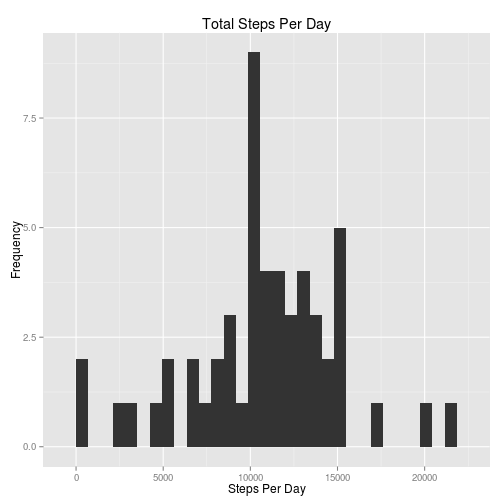
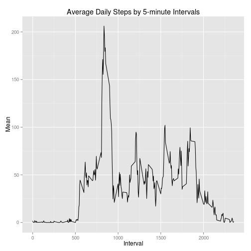
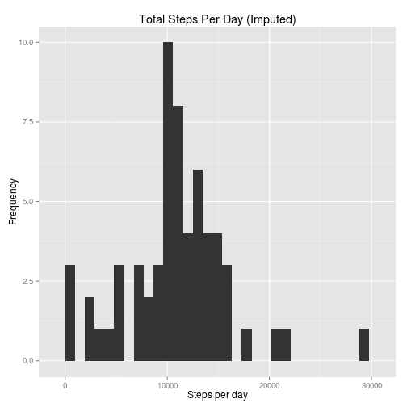
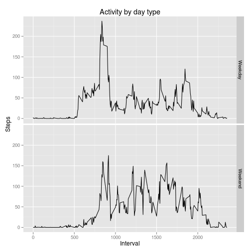

# Reproducible Research Peer Assignment 1
### by Jason Acacio on 08/13/2014
#### In partial fulfillment of the requirements for the course.

------

The report below follows the outline presented in the assignment per the following URL:
https://github.com/jasonacacio/RepData_PeerAssessment1/blob/master/README.md

### Loading and preprocessing the data

Loading the needed libraries in R for future use and the specified data set in R, making sure _activity.zip_ is in the home folder:


```r
library(ggplot2)
library(plyr)
unzip("activity.zip")
data <- read.csv("activity.csv")
head(data, 12)
```

```
##    steps       date interval
## 1     NA 2012-10-01        0
## 2     NA 2012-10-01        5
## 3     NA 2012-10-01       10
## 4     NA 2012-10-01       15
## 5     NA 2012-10-01       20
## 6     NA 2012-10-01       25
## 7     NA 2012-10-01       30
## 8     NA 2012-10-01       35
## 9     NA 2012-10-01       40
## 10    NA 2012-10-01       45
## 11    NA 2012-10-01       50
## 12    NA 2012-10-01       55
```

### What is the mean total number of steps taken per day?

#### Make a histogram of the total number of steps taken each day

Let's massage the data a little bit using tapply so that it creates an array of the daily total of steps taken. Then create a quick histogram based from the data using ggplot2.


```r
(sday <- tapply(data$steps, data$date, sum))
```

```
## 2012-10-01 2012-10-02 2012-10-03 2012-10-04 2012-10-05 2012-10-06 
##         NA        126      11352      12116      13294      15420 
## 2012-10-07 2012-10-08 2012-10-09 2012-10-10 2012-10-11 2012-10-12 
##      11015         NA      12811       9900      10304      17382 
## 2012-10-13 2012-10-14 2012-10-15 2012-10-16 2012-10-17 2012-10-18 
##      12426      15098      10139      15084      13452      10056 
## 2012-10-19 2012-10-20 2012-10-21 2012-10-22 2012-10-23 2012-10-24 
##      11829      10395       8821      13460       8918       8355 
## 2012-10-25 2012-10-26 2012-10-27 2012-10-28 2012-10-29 2012-10-30 
##       2492       6778      10119      11458       5018       9819 
## 2012-10-31 2012-11-01 2012-11-02 2012-11-03 2012-11-04 2012-11-05 
##      15414         NA      10600      10571         NA      10439 
## 2012-11-06 2012-11-07 2012-11-08 2012-11-09 2012-11-10 2012-11-11 
##       8334      12883       3219         NA         NA      12608 
## 2012-11-12 2012-11-13 2012-11-14 2012-11-15 2012-11-16 2012-11-17 
##      10765       7336         NA         41       5441      14339 
## 2012-11-18 2012-11-19 2012-11-20 2012-11-21 2012-11-22 2012-11-23 
##      15110       8841       4472      12787      20427      21194 
## 2012-11-24 2012-11-25 2012-11-26 2012-11-27 2012-11-28 2012-11-29 
##      14478      11834      11162      13646      10183       7047 
## 2012-11-30 
##         NA
```

```r
qplot(sday, geom="histogram") + labs(x="Steps Per Day", y="Frequency", title="Total Steps Per Day")
```

```
## stat_bin: binwidth defaulted to range/30. Use 'binwidth = x' to adjust this.
```

 

#### Calculate and report the mean and median total number of steps taken per day


```r
(mesday <- mean(sday, na.rm=TRUE))
```

```
## [1] 10766
```

```r
(mdsday <- median(sday, na.rm=TRUE))
```

```
## [1] 10765
```

Based from the code above, the mean is 10766 and the median is 10765.

### What is the average daily activity pattern?

#### Make a time series plot (i.e. type = "l") of the 5-minute interval (x-axis) and the average number of steps taken, averaged across all days (y-axis)

First, we take transform the data using plyr's ddply to output a table that summarizes the mean of each interval per day. Then plot the resulting data in ggplot2:


```r
intmeans <- ddply(data, "interval", summarise, mean=mean(steps, na.rm=TRUE))
head(intmeans, 12)
```

```
##    interval    mean
## 1         0 1.71698
## 2         5 0.33962
## 3        10 0.13208
## 4        15 0.15094
## 5        20 0.07547
## 6        25 2.09434
## 7        30 0.52830
## 8        35 0.86792
## 9        40 0.00000
## 10       45 1.47170
## 11       50 0.30189
## 12       55 0.13208
```

```r
ggplot(intmeans, aes(interval, mean)) + geom_path() + 
labs(title="Average Daily Steps by 5-minute Intervals", x="Interval", y="Mean")
```

 

#### Which 5-minute interval, on average across all the days in the dataset, contains the maximum number of steps?


```r
intmeans[which.max(intmeans$mean),]
```

```
##     interval  mean
## 104      835 206.2
```

Based from the above output, the largest 5-minute interval has the interval ID 835, with a mean of 206.1698

### Imputing missing values

#### Calculate and report the total number of missing values in the dataset (i.e. the total number of rows with NAs)


```r
as.data.frame(dim(data))[1,1] - sum(complete.cases(data))
```

```
## [1] 2304
```

```r
sum(complete.cases(data$interval))
```

```
## [1] 17568
```

```r
sum(complete.cases(data$date))
```

```
## [1] 17568
```

```r
sum(complete.cases(data$steps))
```

```
## [1] 15264
```
Take the number of rows in the data minus the sum of its complete cases will give you the number of rows with incomplete values. According to the above, 2304 rows have an NA value in them. In addition, all the NA values are found within the steps column, where its number of complete cases is not matching the number of rows in the data set.

Having that established, when also play with the data to see if where exactly the missing values lie:


```r
(daynas <- ddply(data, "date", summarise, na.count=sum(is.na(steps))))
```

```
##          date na.count
## 1  2012-10-01      288
## 2  2012-10-02        0
## 3  2012-10-03        0
## 4  2012-10-04        0
## 5  2012-10-05        0
## 6  2012-10-06        0
## 7  2012-10-07        0
## 8  2012-10-08      288
## 9  2012-10-09        0
## 10 2012-10-10        0
## 11 2012-10-11        0
## 12 2012-10-12        0
## 13 2012-10-13        0
## 14 2012-10-14        0
## 15 2012-10-15        0
## 16 2012-10-16        0
## 17 2012-10-17        0
## 18 2012-10-18        0
## 19 2012-10-19        0
## 20 2012-10-20        0
## 21 2012-10-21        0
## 22 2012-10-22        0
## 23 2012-10-23        0
## 24 2012-10-24        0
## 25 2012-10-25        0
## 26 2012-10-26        0
## 27 2012-10-27        0
## 28 2012-10-28        0
## 29 2012-10-29        0
## 30 2012-10-30        0
## 31 2012-10-31        0
## 32 2012-11-01      288
## 33 2012-11-02        0
## 34 2012-11-03        0
## 35 2012-11-04      288
## 36 2012-11-05        0
## 37 2012-11-06        0
## 38 2012-11-07        0
## 39 2012-11-08        0
## 40 2012-11-09      288
## 41 2012-11-10      288
## 42 2012-11-11        0
## 43 2012-11-12        0
## 44 2012-11-13        0
## 45 2012-11-14      288
## 46 2012-11-15        0
## 47 2012-11-16        0
## 48 2012-11-17        0
## 49 2012-11-18        0
## 50 2012-11-19        0
## 51 2012-11-20        0
## 52 2012-11-21        0
## 53 2012-11-22        0
## 54 2012-11-23        0
## 55 2012-11-24        0
## 56 2012-11-25        0
## 57 2012-11-26        0
## 58 2012-11-27        0
## 59 2012-11-28        0
## 60 2012-11-29        0
## 61 2012-11-30      288
```

Eight days have a consistent number of missing intervals with them. Conveniently, 288 is the total number of 5-minute intervals in a day. A quick calculation confirms this:


```r
60 * 24 / 5 # Minutes in a hour times hours in a day, then the result divided by 5
```

```
## [1] 288
```

We can then fully say that no data was gathered for these 8 days.

#### Devise a strategy for filling in all of the missing values in the dataset. The strategy does not need to be sophisticated. For example, you could use the mean/median for that day, or the mean for that 5-minute interval, etc.

Per the suggestion in the assignment, we can impute by populating the days which are missing data with the mean
values *for that day of the week*.

Let's add a **weekday** column to the data:


```r
datenas <- unique(daynas$date[daynas$na.count != 0])
data$weekday <- factor(weekdays(as.Date(data$date)),
levels=c("Sunday", "Monday", "Tuesday", "Wednesday", "Thursday", "Friday", "Saturday"))
head(data)
```

```
##   steps       date interval weekday
## 1    NA 2012-10-01        0  Monday
## 2    NA 2012-10-01        5  Monday
## 3    NA 2012-10-01       10  Monday
## 4    NA 2012-10-01       15  Monday
## 5    NA 2012-10-01       20  Monday
## 6    NA 2012-10-01       25  Monday
```

```r
(wkdaynas <- unique(data[data$date %in% datenas,]$weekday))
```

```
## [1] Monday    Thursday  Sunday    Friday    Saturday  Wednesday
## Levels: Sunday Monday Tuesday Wednesday Thursday Friday Saturday
```

#### Create a new dataset that is equal to the original dataset but with the missing data filled in.

Compute the mean within each five-minute interval separately for each weekday and fill in the missing values:


```r
meansd <- ddply(data, c("interval", "weekday"), summarise, steps=mean(steps, na.rm=TRUE))

comp <- complete.cases(data)
complete <- data[comp,]
incomplete <- data[!comp,]

merged <- merge(incomplete[, c("weekday", "interval", "date")], meansd,
by=c("interval", "weekday"))

imp <- rbind(complete, merged)
```

#### Make a histogram of the total number of steps taken each day and Calculate and report the mean and median total number of steps taken per day. Do these values differ from the estimates from the first part of the assignment? What is the impact of imputing missing data on the estimates of the total daily number of steps?


```r
impsday <- tapply(imp$steps, data$date, sum)
qplot(impsday, geom="histogram") +
labs(x="Steps per day", y="Frequency",
title="Total Steps Per Day (Imputed)")
```

```
## stat_bin: binwidth defaulted to range/30. Use 'binwidth = x' to adjust this.
```

 

```r
(meimpsday <- mean(impsday, na.rm=TRUE))
```

```
## [1] 10821
```

```r
(mdimpsday <- median(impsday, na.rm=TRUE))
```

```
## [1] 11015
```

Mean has become 10821 (10766 per original data) and the median has become 11015 (10765 per original data). Imputation has increased the right side of the histogram which explains the increase in the median.

### Are there differences in activity patterns between weekdays and weekends?

#### Create a new factor variable in the dataset with two levels -- "weekday" and "weekend" indicating whether a given date is a weekday or weekend day.


```r
wkends <- c("Saturday", "Sunday")
daytype <- factor(imp$weekday %in% wkends)
imp$daytype <- mapvalues(daytype, from=c("FALSE", "TRUE"), to=c("Weekday", "Weekend"))
impmean <- ddply(imp, .(interval, daytype), summarise, mean=mean(steps, na.rm=TRUE))
head(impmean)
```

```
##   interval daytype  mean
## 1        0 Weekday 2.311
## 2        0 Weekend 0.000
## 3        5 Weekday 0.450
## 4        5 Weekend 0.000
## 5       10 Weekday 0.175
## 6       10 Weekend 0.000
```

#### Make a panel plot containing a time series plot (i.e. type = "l") of the 5-minute interval (x-axis) and the average number of steps taken, averaged across all weekday days or weekend days (y-axis).


```r
ggplot(impmean, aes(interval, mean)) + geom_line() + facet_grid(daytype ~ .) +
labs(x="Interval", y="Steps", title="Activity by day type")
```

 

Notice the slight shift of activity during the weekends where the person starts and ends later in the day by roughly 500 intervals. Which makes sense if this person sleeps in during the weekday and goes to sleep later in the night.

